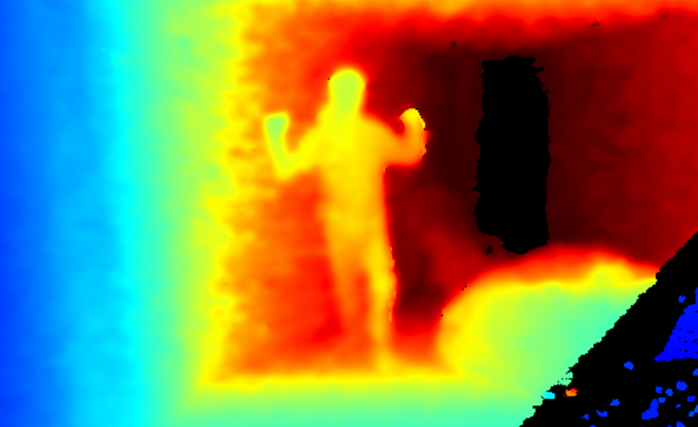

    

# RSPOP: RealSense Plus OpenPose

This application allows to use [**RealSense depth cameras**](https://www.intelrealsense.com/) in conjuction with the [**OpenPose library**](https://github.com/CMU-Perceptual-Computing-Lab/openpose) to estimate 3D human pose keypoints, creating C3D files for analysis of human movement and gait.

    
    

This project was recently created to conduct a study of human gait in the near future, comparing the results that can be obtained with Intel's depth cameras and a high-precision optoelectronic system for motion analysis. The results will determine the possibilities of creating low-cost, portable motion labs by relying solely on intel's cameras and the RSPOP software. For this reason, the source code cannot yet be published.

* [Use](https://github.com/JuanMiguelGV/rspop#use)
* [Installation](https://github.com/JuanMiguelGV/rspop#installation)
	- [Install OpenPoseDemo](https://github.com/JuanMiguelGV/rspop#install-openposedemo)
	- [Download RSPOP binaries and required DLL files](https://github.com/JuanMiguelGV/rspop#install-rspop)

## Use
1. If you have access to a RealSense depth camera, you can record a video using the [**Intel RealSense Viewer**](https://github.com/IntelRealSense/librealsense/releases) (You don't need to download and install the SDK, you can just download the **Intel.RealSense.Viewer.exe** from the provided assets). The recording must include the Depth and Color streams.
   
   If you don't have access to a RealSense depth camera, an example file can be provided. These are usually big files, around 100 MB per second of recording. In the near future a link with a small example file would be posted here.
2. After installing the [**OpenPose Windows Portable Demo**](https://github.com/CMU-Perceptual-Computing-Lab/openpose/blob/master/doc/installation/0_index.md#windows-portable-demo) and downloading the RSPOP binaries, extract the zip file to the same folder where the OpenPoseDemo was installed.
3.  Run the command promt and navigate to the rspop directory. You can then run the rspop.exe, the input parameters are as follows:
    - `[-i/--input]` file_name.bag
    - `[-o/--output]` output_file_name (optional)
    - `[-ch/--height]` height of the RealSense camera from the floor, at the time of recording in cm (recommended)
    - `[-2/--2d]` Used to keep 2d pose .json output files created by the OpenPose library (optional flag)
    - `[-c/--color]` Used to keep the color frame files passed to OpenPose to create pose files (optional flag)
4. If everything was done right, the program will run and show the different steps progress. Allow a good time for the program to finish, the longest task is running OpenPose to create the 2D keypoints.

**Note:** To ensure the software will work, it must be contained in a folder named **"rspop"**, along with the ezc3d and realsense2 DLL files. Also, the openpose folder must be located in the same directory as the rspop folder.

## Installation

### Install OpenPoseDemo:
To install the latest OpenPose Windows portable demo you can follow the [**instructions**](https://github.com/CMU-Perceptual-Computing-Lab/openpose/blob/master/doc/installation/0_index.md#windows-portable-demo) posted in the OpenPose repository.

### Install RSPOP:
To install RSPOP just download the latest version from the [**releases page**](https://github.com/JuanMiguelGV/rspop/releases) and extract the zip file in the same directory that contains the OpenPoseDemo installation.
